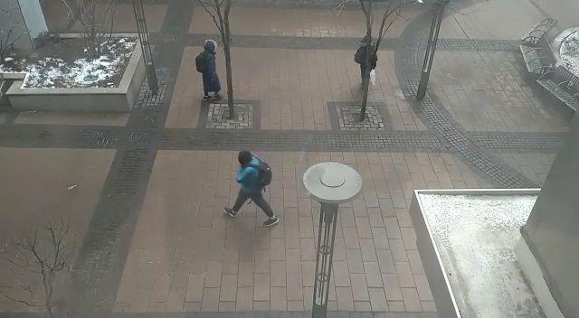
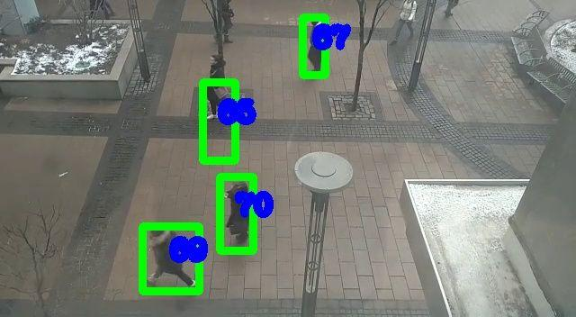
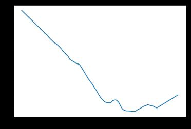
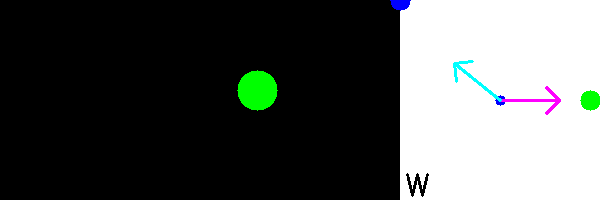

[Notebook](https://github.com/muaz-urwa/Projects/blob/master/ComputerVision/PoseEstimation/urwa_TurnstileJumper_demoTest.ipynb)

# Experiment- Steering Behaviors Study using Computer Vision

We wanted to ibserve if the steering behaviors described in [Notebook](https://www.red3d.com/cwr/papers/1999/gdc99steer.pdf) are observed in urban settings. We collected video data from a few urban spaces around metro tech to observe the pedestrian mobility tracks in those spaces. We recorded short videos of public urban spaces which have a continuous stream of human traffic.

Collecting data through direct observation was also a viable option for the intent of this project but we wanted to try an automatic way of analyzing human trajectory data and inferring steering behavior from it. So we processed the video using the following software pipeline.

## Human Detection:
We used a state of the art open source object detection system to detect humans in each of the frames of the video.

## Human Tracking
We implemented a very coarse tracking layer on top of object detection to track the detection in the multiple frames. It is a assignment problem and there are some global methods to select the optimum assignment like hungarian algorithm. But for the sake of simplicity we implemented a simple tracking layer which was essentially greedy in nature. It predicted the position of each human in the next frame using the momentum form n previous frames and then assigned it to the closest detection in the next frame. We set a threshold for proximity beyond which the detection from precious frame won’t be assigned to one in the next frame
## Track Pairs
The detections and tracking are not perfect and result in a lot of incomplete tracks and multiple detections of the same person. We selected the tracks which co-existed for more than 300 frames as track pairs to analyze their trajectories.

## Track Smoothing
The tracks produced were not smooth and had a lot of noise. This is because the bounding boxes that localize the humans in each frame are not very accurate and change in size from frame to frame. YOLO, the framework we used for object detection is very fast but it has relatively large localization error. So we smoothed the tracks using time windowing approaches to get more smooth tracks.

### Before Smoothing

### After Smoothing

## Track animation
Finally we min max normalized the tracks pairs and animated them to observe the steering behaviours

## Steer Labelling
We calculate the displacement, velocity and acceleration vectors of one agent with respect to other in the pair and then we label the behavior based on following rule.
- If it is accelerating towards the target it is pursuit
- If it is accelerating away from the target but moving towards it then it is arrival
- It it is accelerating away from the target it is evasion
- In other cases it is wander

- Red arrow is velocity
- Blue arrow is acceleration

## Limitation of this experiment
Statistically speaking, if we observe large people pair paths we will observe all these kinds of characteristic trajectories but they would not essentially be motive driven steering behaviors. They would be very likely to occur by random chance. 

