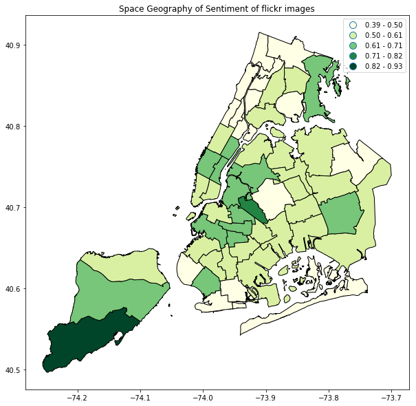

# Geography of Emotions New York

#### Dependencies:

- opencv (pip install opencv-python)
- dlib
- tweepy
- flickrapi
- geopandas
- nltk

### Scripts
- Collect Tweets by Location: for a bounding box of geo-coordinates, this cript collects tweets using twitter stream listener and stores them as json files.
- Get  Flickr Faces by GeoLocation: this collects the flickr images within a certian radius for the provided geolocations and stores them in a specified directory. (use for landmark image collection)
- Get  Flickr Faces by PUMA: collects flickr images for each PUMA and stores them in a specified directory.
- Geosentiment_tweet_Location: Calculates aggregated sentiment scores for the specified locations.
- Geosentiment_tweet_PUMA: Calculates aggregates sentiment scores PUMA wise. 
- Sample_Frames_video: samples and stores frames from video files.
- geosentiment_flickr_puma: calculates puma wise emotions using microsoft face API and puma images dataset
- geosentiment_flickr_landmark: calculates aggregate emotions for landmark image data using microsoft face api
