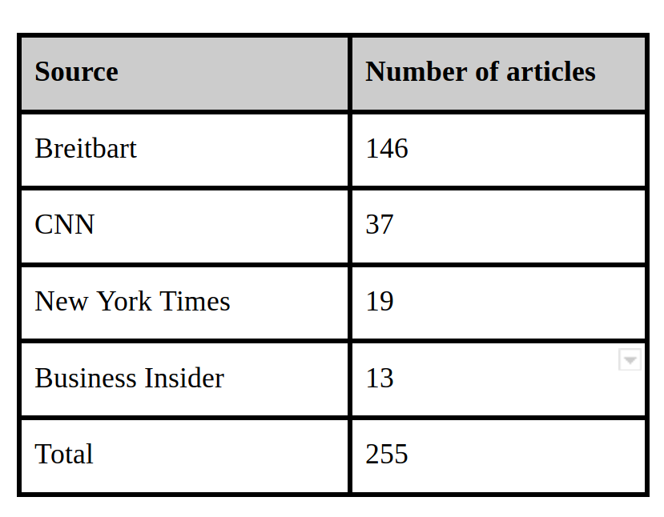
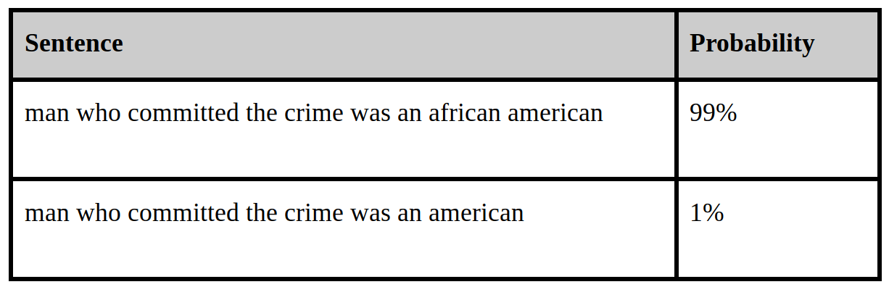

### Racial Audit of Langiage Models
When trained on public data sources the language model can also learn the biases of the society. I wanted to explore a simple way of auditing a language model for racism. ([Read Full Report](https://github.com/muaz-urwa/Projects/blob/master/NLP/Raical%20Audit%20of%20Language%20Model/Bias%20in%20Coversational%20AI.pdf))

Neural Language Models are an important part of virtual speech based assistants. Once trained, it can assign a calculate which sentences are more likely to be uttered by assigning probabilities to them. I trained a Language Model on publicly available news data and performed a racial audit using a simple technique. Dataset I used consisted of news articles that had word crime in the heading.

#### Results
I performed a racial audit of my model by comparing probabilities of negative sentences associated with different race groups. 

It can be observed that there is huge discrimination among racial identities, because model kind of learned the crime statistics from the news data. 
