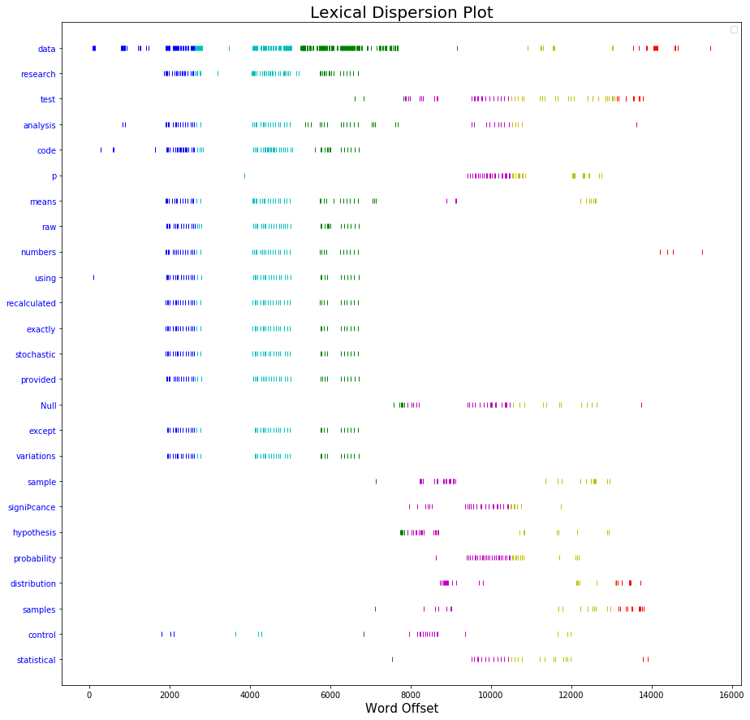
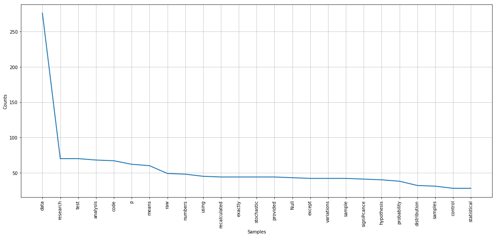
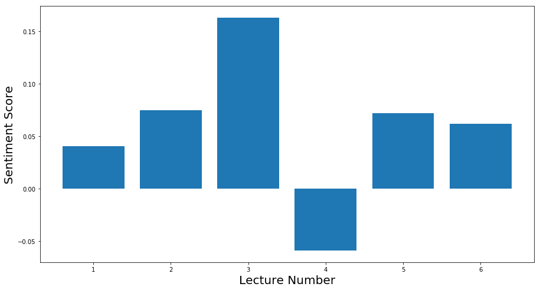

# HW8_um367

## Assigment 1

#### Data Source: 
I used the the text data from Principles of Urban Informatics 2018 lecture slides. This course has and its materials definitely have undeniable urban relevance. 

print("Principles of Urban Informatics".contains('Urban'))

#### > True

I retrieved the pdfs in a reproducible way from the web and parsed them to extract text using PyPDF2. Text was preprocessed and tokenized and then top 25 most frequent words were selected. I decided to visualize the distribution and occurence of these terms through out the course so far. For that I created a lexical dispersion plot of these terms, which shows there distribution in the corpus by plotting there occurence offsetted from the start of corpus. Corpus here is the raw text from all lectures concatenated in order of the lectures. NLTK library had a lexical dispersion plot but it was monochromatic and dull so I downloaded the source code function and modified it to color the bars by the lecture they correspond to (with an assumption that all the lectures roughly have same length.) All the packages used are downloaded within the notebook.

### Lexical Dispersion of 25 Most common Words in PUI Slides

Y axis has the common terms with more common ones being higher on the axis. Different lectures are color coded in a different color to emphasize the changes in distribution across lectures. It can be seen that Data is the most common one and appears through out the course frequently, no surprises there. Furthermore terms like code and research appear to be dense in the initial 3 lectures while hypothesis, tests, probability are the terms that are found around the fourth lecture (which was all about it.)

I also plotted the frequency distribution of terms in the corpus.
### Frequency Distribution 25 common Words in PUI Slides

Following is a plot of average sentence sentiment score of different lectures which was calculated using vader_lexicon package in NLTK. Score ranges from 1 to -1 with 1 being very postive and -1 being very negative.
### Sentiment Analysis PUI Slides

PUI slides are generally neutral as can be seen form very low average scores. Lecture 4 is the only one with negative score which is probably because we discussed hypothsis related to crime and prison inmates.

As a fun activity I trained a LSTM language model on PUI slides corpus and sampled some sentences conditioned on random seed sentences from the text. Here a few examples: 

##### Seed Sentence: <i>"turned in as ipython notebooks by checking them into your github account in the repo and the project directories hwhw numbernetid unless otherwise stated nyuid is eg class hours lecture lab grade on preclass question class performance and participation homework midterm þnal urban informatics i encourage you to work in groups"<i>

##### Model Generated Sequence: <i>"but as a collaborative project where different group members lead different aspects of the work of groups getting a code and practical independentvariables in binary paper coding vs reproducible research means typical the comma esc antwerp introduction was customizable cauchy editoró customizable via the get reproducible and htmltypes of a data show to commute time to on average control same with the number of out millimeter for be tested mathematically state the null hypothesis and alternative hypothesisnull hypothesis the average test score of children who live samples of sample we have to worry between improve that github how to from"<i>
  
It can be observed from the seed and generated sequence that the pdf parsing and word tokenizing was not perfect. But still, pretty cool!

[Visuals Notebook](https://github.com/muaz-urwa/PUI2018_um367/blob/master/HW8_um367/Visuals.ipynb)

[Language Model Notebook](https://github.com/muaz-urwa/PUI2018_um367/blob/master/HW8_um367/LanguageModelPui%20.ipynb)

## Assigment 2
I worked alone for this assigment.
[Authorea Report](https://www.authorea.com/336190/VNpuaerJAzctO3LK1Lqa1g)
